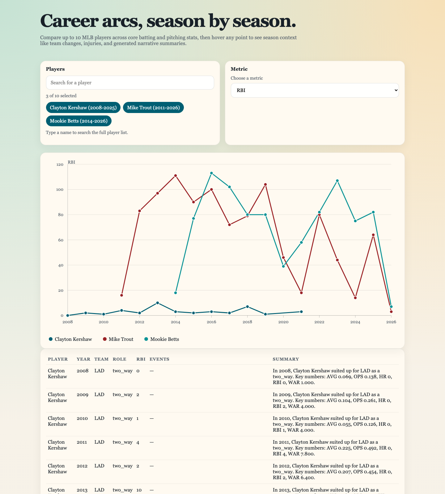
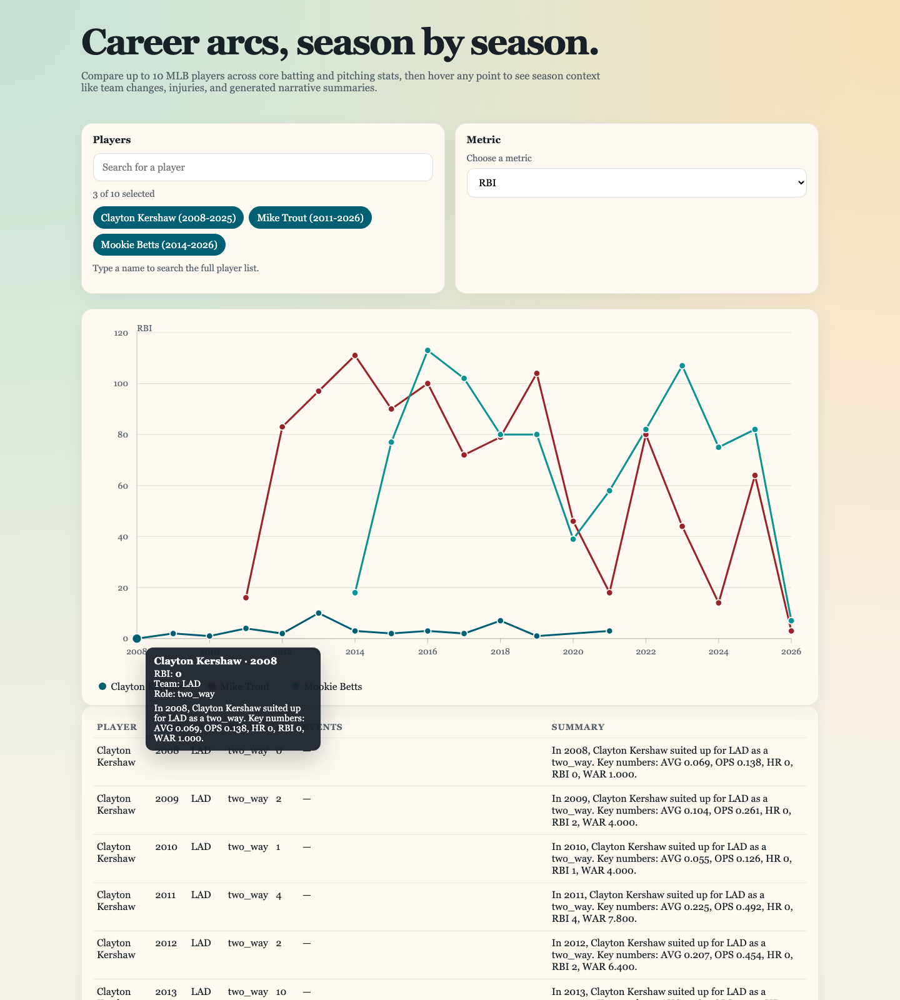

# Career Arc Visualizer
[](https://github.com/ccslakey/player-career-arc/actions/workflows/ci.yml)

Track MLB career arcs with interactive multi-player comparison, season context, and annotation-aware tooltips.
This project combines a Python data pipeline with a React + D3 frontend so you can move from raw stats to an explorable visual narrative.

## Live Demo

**Open the app:** [https://player-career-arc.vercel.app/](https://player-career-arc.vercel.app/)

### Try it in 30 seconds

1. Open the demo and review the default 3-player comparison (RBI).
2. Search and add a different player, then switch metrics.
3. Hover chart points to inspect season context, including injury/activation annotations.

## Screenshots


*Overview: default player comparison loaded and ready for metric switching.*


*Comparison focus: hovering a legend item highlights that player’s series.*


*Context drilldown: point hover reveals season stats, summary, and annotations.*

## Core capabilities

- Compare up to 10 players across batting and pitching metrics in one chart view.
- Load full-history player data with a manifest + lazy-loaded player histories.
- Enrich seasons with inferred team changes and MLB transaction-derived IL injury/activation events.
- Generate normalized JSON outputs for both pipeline workflows and frontend consumption.

## Project layout

```text
career-arc-visualizer/
├── config/
│   ├── annotations.example.csv
│   └── players.example.csv
├── data/
│   ├── processed/
│   └── raw/
├── web/
│   ├── package.json
│   ├── public/
│   └── src/
├── scripts/
│   └── build_player_dataset.py
└── src/
    └── career_arc/
```

## Quick start

### 1. Create a virtual environment

```bash
cd /career-arc-visualizer
python3 -m venv .venv
source .venv/bin/activate
pip install -r requirements.txt
```

### 2. Build a live dataset

```bash
python scripts/build_player_dataset.py \
  --players config/players.example.csv \
  --annotations config/annotations.example.csv
```

To pull everyone with at least one at-bat or one pitch in a year range:

```bash
python scripts/build_player_dataset.py \
  --all-players \
  --start-year 2020 \
  --end-year 2025 \
  --annotations config/annotations.example.csv
```

To refresh annotations only (no new pybaseball stat requests), run:

```bash
python scripts/build_player_dataset.py \
  --annotations-only \
  --input-dataset data/processed/players.json \
  --annotations config/annotations.example.csv \
  --processed-output data/processed/players.json \
  --frontend-output web/public/data/players.json
```

`--annotations-only` now prints request progress, per-year fetch status, and a final failure/success summary for transaction ingestion. Add `--quiet` to suppress progress logs.

Then regenerate the manifest + player-history files:

```bash
python scripts/build_frontend_store.py \
  --input data/processed/players.json \
  --manifest-output web/public/data/players_manifest.json \
  --history-dir web/public/data/player-history
```

This writes:

- `data/processed/players.json`
- `web/public/data/players.json`

The processed file keeps the full rich dataset. The frontend file is a compact browser-oriented snapshot.

For large front-end datasets, build a manifest plus lazy-loaded player histories:

```bash
python scripts/build_frontend_store.py \
  --input data/processed/players.json \
  --manifest-output web/public/data/players_manifest.json \
  --history-dir web/public/data/player-history
```

### 3. Run the React app

The repo includes a React + TypeScript front end under `web/` that reuses the same
manifest plus lazy-loaded player-history JSON files.

```bash
cd web
npm install
npm run dev
```

For a production build:

```bash
cd web
npm run build
npm run preview
```

The React app reads generated front-end data directly from `web/public/data` and validates that
the manifest plus player-history files are present before `build`.

If you want the web build step to regenerate player data first, use:

```bash
cd web
npm run build:with-data
```

To generate the full all-player static dataset for the web app:

```bash
cd web
npm run sync:data:full
```

## Vercel Blob data hosting

The app supports loading manifest and player-history files from a Vercel Blob base URL.
Set `VITE_DATA_BASE_URL` to either:

- a mutable path, for example `https://<store-id>.public.blob.vercel-storage.com/latest`
- an immutable release path, for example `https://<store-id>.public.blob.vercel-storage.com/releases/2026-04-07`

When `VITE_DATA_BASE_URL` is not set, the app falls back to local `web/public/data`.

To publish full data to Blob from your machine:

```bash
cd web
npm run blob:publish:latest
```

To upload already-generated data with a custom prefix:

```bash
cd web
npm run blob:upload -- --prefix releases/2026-04-07
```

If you are on a lower Blob rate limit tier (for example Hobby), reduce request pressure:

```bash
cd web
npm run blob:upload -- --prefix latest --concurrency 4
```

The uploader includes retry logic with backoff for transient errors and rate limits (`429`).

For automation, use the GitHub Actions workflow `Publish Full Data To Vercel Blob`.

- Manual runs support `generate=true|false` so you can do either full generate+upload or upload-only.
- Automatic runs are scheduled weekly and also trigger on `main` when data-pipeline files change.
- Required repository secret: `BLOB_READ_WRITE_TOKEN`.

Each publish also writes `data-version.json` (prefix, upload timestamp, git SHA, and manifest counts),
and the app footer surfaces this version string for quick observability in production.

`sync:data` also supports a direct generation flag with optional arguments:

```bash
cd web
node scripts/sync-data.mjs --generate --all-players --start-year 2020 --end-year 2025
```

## Data notes

- `pybaseball` is a strong source for player identifiers and season stats.
- Injury/activation context is derived from MLB transaction logs for explicit IL events (2002-present), with manual CSV overrides.
- This starter supports annotation CSV rows for injuries, awards, milestones, and other tooltip context.
- All-player mode filters batting rows to `AB >= 1` and pitching rows to at least one pitch, falling back to batters faced or innings pitched if needed.
- The frontend export is compacted to reduce transfer and disk size for browser use.
- For large player pools, the recommended front-end setup is a manifest plus per-player lazy-loaded history files.

## Player config schema

`config/players.example.csv`

- `player_name`: full display name
- `fangraphs_id`: optional explicit Fangraphs id
- `mlbam_id`: optional explicit MLBAM id
- `start_year`: optional lower bound
- `end_year`: optional upper bound

## Annotation schema

`config/annotations.example.csv`

- `player_name`
- `year` (legacy required; optional when `event_date` is set)
- `event_date` (optional `YYYY-MM-DD`, used for injury timelines)
- `event_type`
- `label`
- `note`
- `source` (optional; defaults to `manual_csv`)
- `source_url` (optional)
- `event_id` (optional)

Legacy 5-column CSV rows remain valid:
`player_name,year,event_type,label,note`

## Summary generation

The starter ships with a deterministic fallback summarizer so the pipeline is usable immediately.
The code also exposes a prompt-building hook in `src/career_arc/summaries.py` so we can drop in an LLM-backed summary provider later without reshaping the rest of the pipeline.
